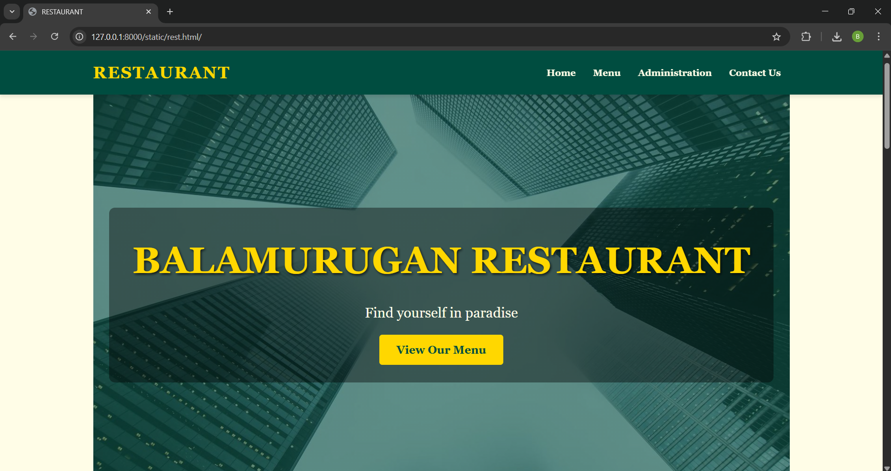
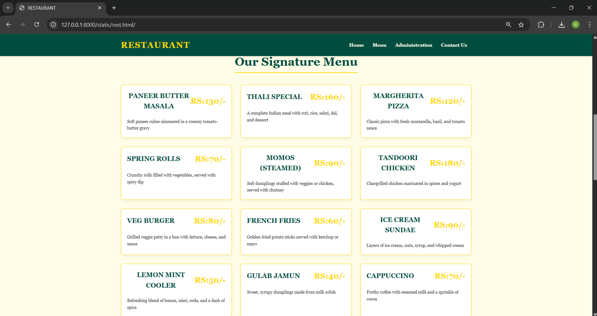
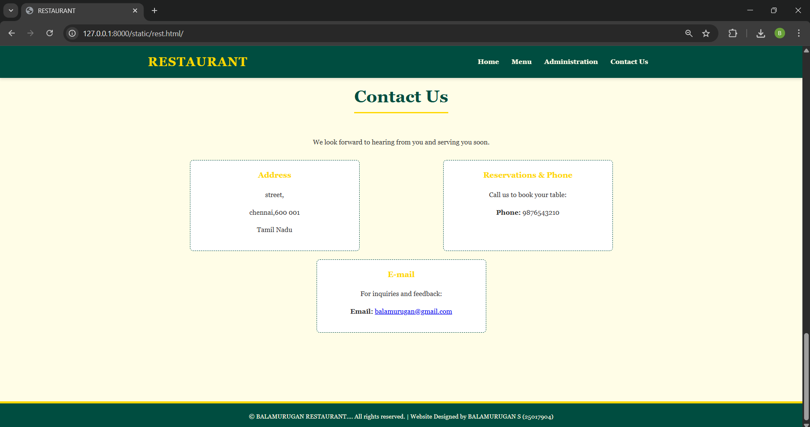

# Ex.06 Restaurant Website
## Date:19/12/2025

## AIM:
To develop a static Restaurant website to display the food items and services provided by them.

## DESIGN STEPS:

### Step 1:
Requirement collection.

### Step 2:
Creating the layout using HTML and CSS.

### Step 3:
Updating the sample content.

### Step 4:
Choose the appropriate style and color scheme.

### Step 5:
Validate the layout in various browsers.

### Step 6:
Validate the HTML code.

### Step 7:
Publish the website in the given URL.

## PROGRAM:
rest.html
```py
<!DOCTYPE html>
<html lang="en">
<head>
    <meta charset="UTF-8">
    <meta name="viewport" content="width=device-width, initial-scale=1.0">
    <title>RESTAURANT</title>
    <style>


        :root {
            --color-primary: #004D40;
            --color-secondary: #FFFDE7;
            --color-accent: #FFD700;
            --color-dark-text: #333;
        }

        /* ----------------------- GENERAL STYLES ----------------------- */
        body {
            font-family: 'Georgia', serif;
            margin: 0;
            padding: 0;
            background-color: var(--color-secondary);
            color: var(--color-dark-text);
            line-height: 1.6;
        }

        h1, h2, h3 {
            color: var(--color-primary);
            text-align: center;
        }

        h2 {
            font-size: 2.5em;
            margin-bottom: 0.5em;
            border-bottom: 3px solid var(--color-accent);
            display: inline-block;
            padding-bottom: 5px;
        }

        section {
            padding: 60px 20px;
            max-width: 1200px;
            margin: auto;
            min-height: 80vh;
        }
        #navbar {
            background-color: var(--color-primary);
            color: var(--color-secondary);
            padding: 15px 0;
            position: sticky;
            top: 0;
            z-index: 1000;
            box-shadow: 0 4px 6px rgba(0, 0, 0, 0.1);
        }
        #navbar .nav-container {
            display: flex;
            justify-content: space-between;
            align-items: center;
            max-width: 1200px;
            margin: auto;
            padding: 0 20px;
        }
        #navbar .logo {
            font-size: 1.8em;
            font-weight: bold;
            color: var(--color-accent);
            letter-spacing: 2px;
        }
        #navbar ul {
            list-style: none;
            margin: 0;
            padding: 0;
            display: flex;
        }
        #navbar ul li a {
            color: var(--color-secondary);
            text-decoration: none;
            padding: 10px 15px;
            display: block;
            transition: background-color 0.3s, color 0.3s;
            font-weight: bold;
        }
        #navbar ul li a:hover {
            background-color: var(--color-accent);
            color: var(--color-primary);
            border-radius: 5px;
        }
        #home {
            padding: 0; 
            min-height: 100vh;
            display: flex;
            align-items: center;
            justify-content: center;
            text-align: center;
            background: linear-gradient(rgba(0, 77, 64, 0.6), rgba(0, 77, 64, 0.6)), 
                        url('https://fastly.picsum.photos/id/972/1600/900.jpg?hmac=2w8uF82yaqCYdmpE-OGgrlr5WUldxWAzRwqig_HWj4w') no-repeat center center/cover;
            color: var(--color-secondary);
        }
        #home .banner-content {
            padding: 40px;
            background: rgba(0, 0, 0, 0.4);
            border-radius: 10px;
        }
        #home h1 {
            font-size: 4em;
            margin: 0;
            color: var(--color-accent);
            text-shadow: 2px 2px 4px rgba(0, 0, 0, 0.7);
        }
        #home p {
            font-size: 1.5em;
            margin: 20px 0 30px;
        }
        .cta-button {
            background-color: var(--color-accent);
            color: var(--color-primary);
            padding: 15px 30px;
            text-decoration: none;
            font-size: 1.2em;
            border-radius: 5px;
            font-weight: bold;
            transition: background-color 0.3s, transform 0.3s;
        }
        .cta-button:hover {
            background-color: #e6b800; 
            transform: scale(1.05);
        } 
        #menu h2 {
            margin-bottom: 40px;
        }
        .menu-grid {
            display: grid;
            grid-template-columns: repeat(auto-fit, minmax(300px, 1fr));
            gap: 30px;
        }
        .menu-item {
            background-color: #fff;
            padding: 20px;
            border: 1px solid var(--color-accent);
            border-radius: 8px;
            box-shadow: 0 4px 10px rgba(0, 0, 0, 0.05);
            transition: transform 0.3s;
        }
        .menu-item:hover {
            transform: translateY(-5px);
            box-shadow: 0 8px 15px rgba(0, 0, 0, 0.1);
        }
        .menu-item h3 {
            color: var(--color-primary);
            margin-top: 0;
            display: flex;
            justify-content: space-between;
            align-items: center;
            font-size: 1.4em;
        }
        .menu-item .price {
            color: var(--color-accent);
            font-weight: bold;
            font-size: 1.2em;
        }
        .menu-item p {
            font-size: 0.9em;
            color: var(--color-dark-text);
            margin-bottom: 0;
        }       
        #administration {
            background-color: #f7f3e8; 
        }
        .admin-grid {
            display: grid;
            grid-template-columns: repeat(auto-fit, minmax(250px, 1fr));
            gap: 30px;
            margin-top: 40px;
        }
        .admin-card {
            text-align: center;
            padding: 20px;
            background-color: #fff;
            border-radius: 8px;
            box-shadow: 0 2px 5px rgba(0, 0, 0, 0.1);
            transition: box-shadow 0.3s;
        }      
        .admin-card:hover {
            box-shadow: 0 8px 20px rgba(0, 0, 0, 0.2);
        }
        .admin-card img {
            width: 150px;
            height: 150px;
            object-fit: cover;
            border-radius: 50%;
            border: 4px solid var(--color-accent);
            margin-bottom: 15px;
        }
        .admin-card h3 {
            margin: 10px 0 5px 0;
            color: var(--color-primary);
            font-size: 1.3em;
        }
        .admin-card p {
            color: var(--color-dark-text);
            font-style: italic;
            font-weight: bold;
        }
               #contact {
            text-align: center;
        }

        #contact h2 {
            margin-bottom: 40px;
        }
        .contact-info {
            display: flex;
            justify-content: space-around;
            flex-wrap: wrap;
            margin-top: 30px;
        }

        .contact-item {
            flex-basis: 30%;
            min-width: 280px;
            padding: 20px;
            margin-bottom: 20px;
            background-color: #fff;
            border: 1px dashed var(--color-primary);
            border-radius: 8px;
        }

        .contact-item h3 {
            color: var(--color-accent);
            margin-top: 0;
        }

       
        footer {
            background-color: var(--color-primary);
            color: var(--color-secondary);
            text-align: center;
            padding: 20px 0;
            font-size: 0.9em;
            border-top: 5px solid var(--color-accent);
        }

        footer a {
            color: var(--color-accent);
            text-decoration: none;
        }
        
       
        @media (max-width: 768px) {
            #navbar .nav-container {
                flex-direction: column;
                padding-bottom: 10px;
            }

            #navbar ul {
                margin-top: 10px;
                justify-content: center;
            }

            #navbar ul li a {
                padding: 8px 10px;
                font-size: 0.9em;
            }
            
            #home h1 {
                font-size: 3em;
            }

            .menu-grid, .admin-grid, .contact-info {
                grid-template-columns: 1fr;
            }
            
            .contact-item {
                flex-basis: 100%;
            }
        }
        
        @media (max-width: 480px) {
            #home h1 {
                font-size: 2.5em;
            }
            
            #home p {
                font-size: 1.2em;
            }
        }

    </style>
</head>
<body>

    <nav id="navbar">
        <div class="nav-container">
            <div class="logo">RESTAURANT</div>
            <ul>
                <li><a href="#home">Home</a></li>
                <li><a href="#menu">Menu</a></li>
                <li><a href="#administration">Administration</a></li>
                <li><a href="#contact">Contact Us</a></li>
            </ul>
        </div>
    </nav>

    <section id="home">
        <div class="banner-content">
            <h1>BALAMURUGAN RESTAURANT</h1>
            <p>Find yourself in paradise</p>
            <a href="#menu" class="cta-button">View Our Menu</a>
        </div>
    </section>

    <section id="menu">
        <center><h2>Our Signature Menu</h2></center>

       <div class="menu-grid">
    <div class="menu-item">
            <h3>PANEER BUTTER MASALA <span class="price">RS:130/-</span></h3>
            <p>Soft paneer cubes simmered in a creamy tomato-butter gravy</p>
        </div>

        <div class="menu-item">
            <h3>THALI SPECIAL <span class="price">RS:160/-</span></h3>
            <p>A complete Indian meal with roti, rice, sabzi, dal, and dessert</p>
        </div>

        <div class="menu-item">
            <h3>MARGHERITA PIZZA <span class="price">RS:120/-</span></h3>
            <p>Classic pizza with fresh mozzarella, basil, and tomato sauce</p>
        </div>

        <div class="menu-item">
            <h3>SPRING ROLLS <span class="price">RS:70/-</span></h3>
            <p>Crunchy rolls filled with vegetables, served with spicy dip</p>
        </div>

        <div class="menu-item">
            <h3>MOMOS (STEAMED) <span class="price">RS:90/-</span></h3>
            <p>Soft dumplings stuffed with veggies or chicken, served with chutney</p>
        </div>

        <div class="menu-item">
            <h3>TANDOORI CHICKEN <span class="price">RS:180/-</span></h3>
            <p>Chargrilled chicken marinated in spices and yogurt</p>
        </div>

        <div class="menu-item">
            <h3>VEG BURGER <span class="price">RS:80/-</span></h3>
            <p>Grilled veggie patty in a bun with lettuce, cheese, and sauce</p>
        </div>

        <div class="menu-item">
            <h3>FRENCH FRIES <span class="price">RS:60/-</span></h3>
            <p>Golden-fried potato sticks served with ketchup or mayo</p>
        </div>

        <div class="menu-item">
            <h3>ICE CREAM SUNDAE <span class="price">RS:90/-</span></h3>
            <p>Layers of ice cream, nuts, syrup, and whipped cream</p>
        </div>

        <div class="menu-item">
            <h3>LEMON MINT COOLER <span class="price">RS:50/-</span></h3>
            <p>Refreshing blend of lemon, mint, soda, and a dash of spice</p>
        </div>

        <div class="menu-item">
            <h3>GULAB JAMUN <span class="price">RS:40/-</span></h3>
            <p>Sweet, syrupy dumplings made from milk solids</p>
        </div>

        <div class="menu-item">
            <h3>CAPPUCCINO <span class="price">RS:70/-</span></h3>
            <p>Frothy coffee with steamed milk and a sprinkle of cocoa</p>
        </div>
    </div>
    </section>

    <section id="administration">
        <center><h2>Administration Team</h2></center>

        <div class="admin-grid">
            <div class="admin-card">
                <br>
                <br>
                <br>
                <h3>BALAMURUGAN S</h3>
                <p>Executive Director</p>
            </div>
            <div class="admin-card">
                
                <h3>DHONI</h3>
                <p>Head Chef & Culinary Manager</p>
            </div>
            <div class="admin-card">
                
                <h3>VIRAT</h3>
                <p>Front-of-House Manager</p>
            </div>
            <div class="admin-card">
                
                <h3>ROHIT</h3>
                <p>Chief Financial Officer (CFO)</p>
            </div>
            <div class="admin-card">
                
                <h3>HARDIK</h3>
                <p>Head Sommelier</p>
            </div>
            <div class="admin-card">
                
                <h3>WATSON</h3>
                <p>Events Coordinator</p>
            </div>
        </div>
    </section>

    <section id="contact">
        <center><h2>Contact Us</h2></center>
        <p>We look forward to hearing from you and serving you soon.</p>

        <div class="contact-info">
            <div class="contact-item">
                <h3>Address</h3>
                <p> street,</p>
                <p>chennai,600 001</p>
                <p>Tamil Nadu</p>
            </div>

            <div class="contact-item">
                <h3>Reservations & Phone</h3>
                <p>Call us to book your table:</p>
                <p><strong>Phone:</strong> 9876543210</p>
            </div>

            <div class="contact-item">
                <h3>E-mail</h3>
                <p>For inquiries and feedback:</p>
                <p><strong>Email:</strong> <a href="balamurugan@gamil.com">balamurugan@gmail.com</a></p>
            </div>
        </div>
    </section>

    <footer>
        &copy; BALAMURUGAN RESTAURANT.... All rights reserved. | Website Designed by BALAMURUGAN S (25017904)
    </footer>

</body>
</html>

```

## OUTPUT:








## RESULT:
The program for designing software company website using HTML and CSS is completed successfully.
